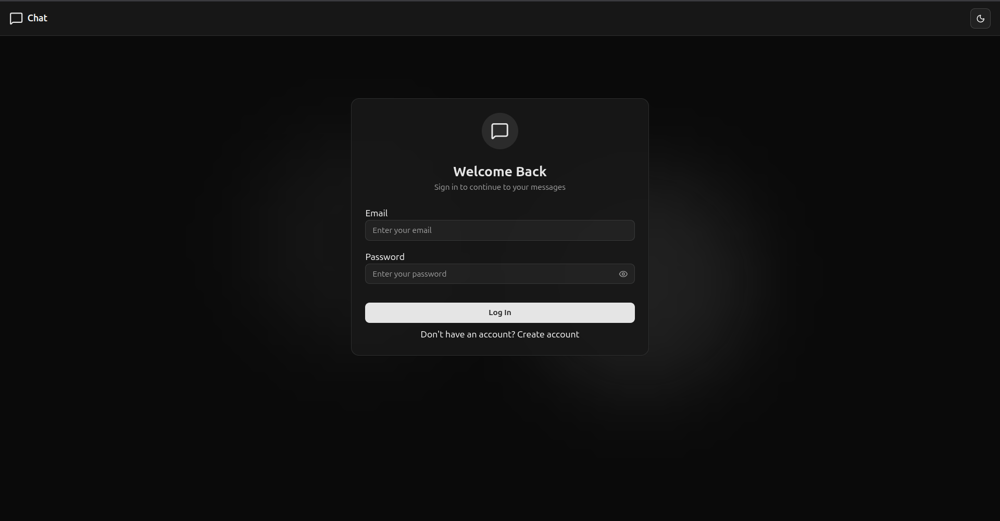
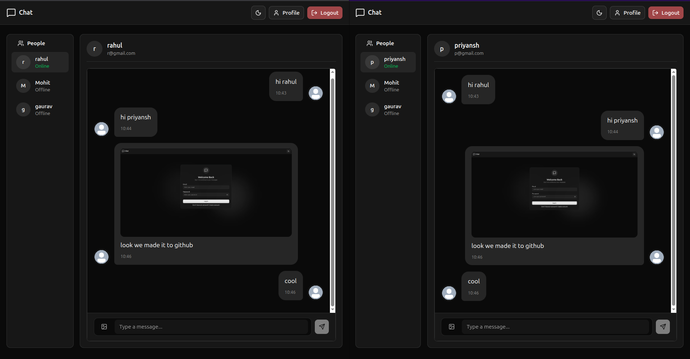

# MyChatApp

A full-stack real-time chat application built using **React**, **Node.js**, **Express**, and **Socket.io**.

---

## 📸 Screenshots

### Login / Signup

### Chat Interface

## 🚀 Features

- User authentication (Login & Signup)
- Real-time messaging with Socket.io
- Online / Offline user status
- User list sidebar
- One-to-one chat
- Modern UI using Tailwind CSS
- Separate frontend and backend structure

---

## 📁 Project Structure
-MyChatApp/
- ├── backend/
- │ ├── src/
- │ ├── package.json
- │ └── .env
- ├── frontend/
- │ ├── src/
- │ ├── package.json
- │ └── .env
- ├── package.json
- └── README.md

## ▶️ Running the Application
- https://mychatapp-pfd1.onrender.com/login
